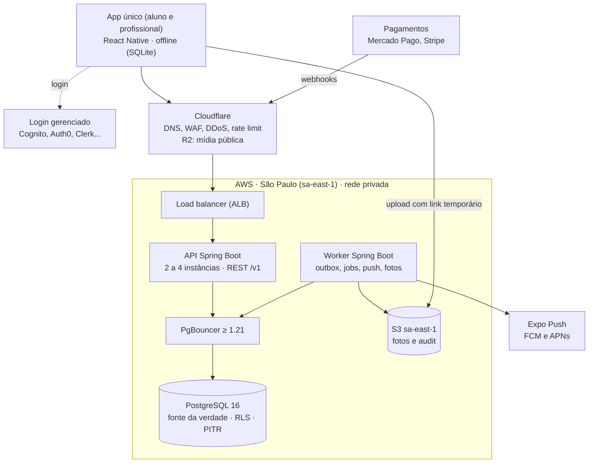
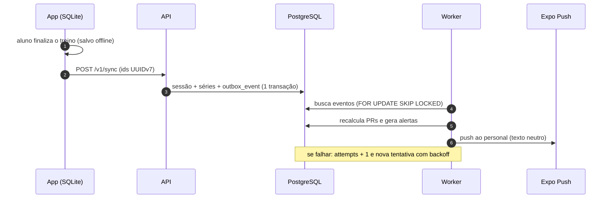
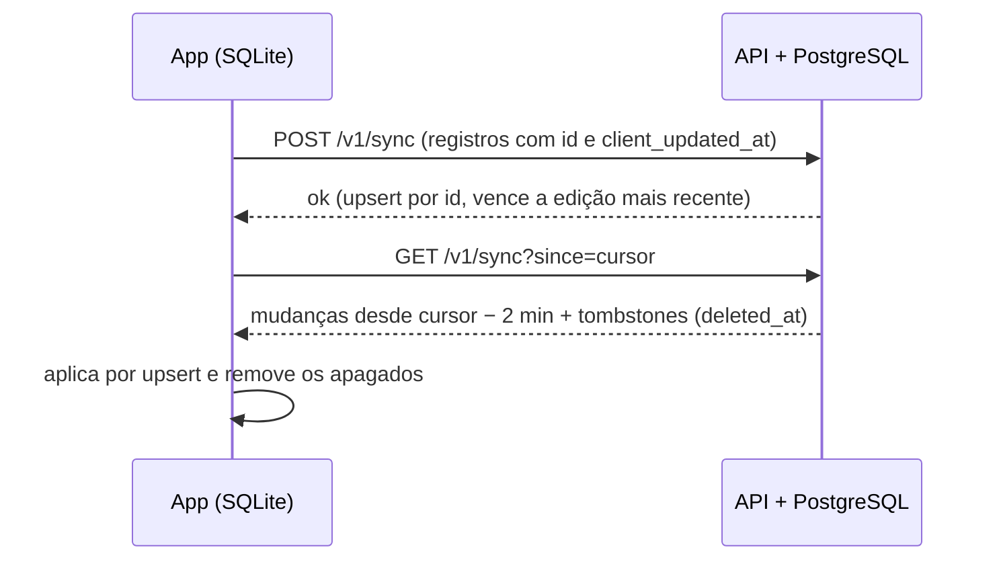
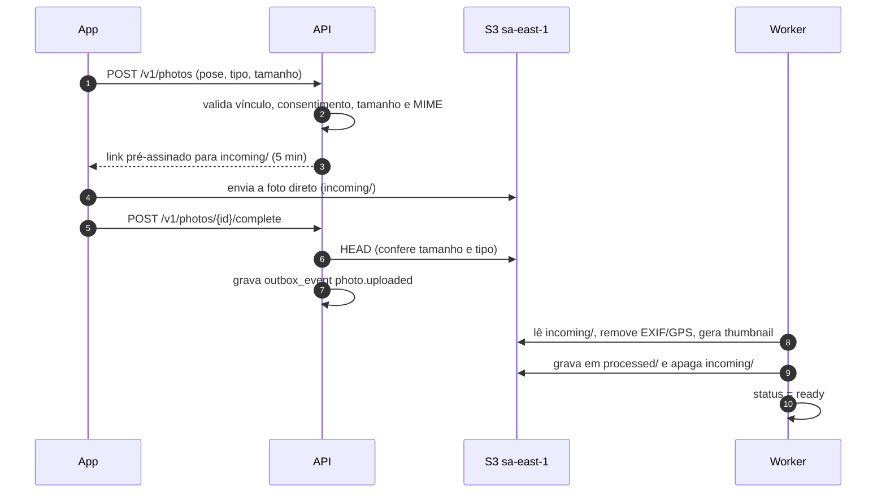
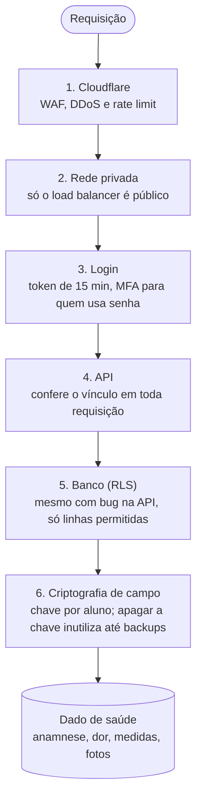
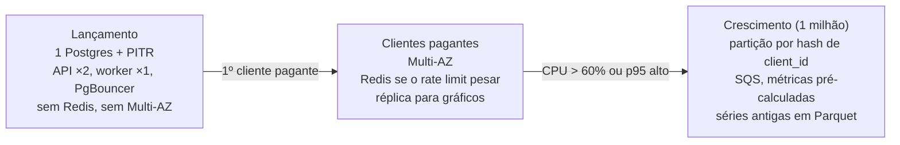

# Arquitetura — SaaS Personal Trainers

**Alvo:** 20 mil usuários (profissionais + alunos), com plano de evolução para 1 milhão.
**Stack base:** Spring Boot, PostgreSQL, React Native (Expo), AWS S3 em São Paulo para arquivos sensíveis e Cloudflare R2 para mídia pública.

> Itens marcados com **Validar** dependem de teste técnico ou de parecer jurídico antes de virar decisão final.
>
> Documentos relacionados: [BACKEND-PATTERN.md](BACKEND-PATTERN.md) · [FRONTEND-PATTERN.md](FRONTEND-PATTERN.md) · [PLANO.md](PLANO.md). Migrations em `backend/src/main/resources/db/migration`.

---

## 1. Dimensionamento (premissas)

| Item | Estimativa para 20 mil contas |
|---|---|
| Usuários ativos por dia | 20% a 30% (4 a 6 mil) |
| Pico de requisições | dezenas a ~100 req/s (picos às 6h–8h e 18h–21h) |
| Séries gravadas (`performed_set`) | ~2 milhões/semana no pior caso, ~100 milhões/ano |
| Fotos de evolução | ~60 a 100 GB/ano (8 fotos/aluno/ano, ~400 KB cada, após compressão) |
| Banco de dados | dezenas de GB no primeiro ano |

Conclusão: **é um volume que um monolito bem feito e um Postgres gerenciado aguentam com folga; nem Redis é necessário no lançamento.** O que protege você aqui são índices corretos, conexões controladas e processamento assíncrono, não microserviços.

---

## 2. Visão geral

Tudo passa pela Cloudflare e termina no PostgreSQL em São Paulo.



| Peça | Papel |
|---|---|
| API | Atende o app (os dois perfis). Stateless, escala horizontal. |
| Worker | Mesmo código, outro perfil: outbox, jobs recorrentes, push, fotos, webhooks, exclusão de conta. |
| PostgreSQL | Fonte da verdade. Single-AZ + PITR no lançamento; Multi-AZ com clientes pagantes; réplica de leitura na fase 2. |
| S3 sa-east-1 | Fotos de evolução (bucket privado) e arquivo frio do audit. |
| Cloudflare R2 | Só mídia pública (imagens e vídeos de exercícios). |
| Redis | Fora do lançamento (entra na fase 2, seção 11). |
| Auth | Provedor gerenciado; JWT validado no Spring via JWKS. |
| Observabilidade | OpenTelemetry → Grafana + Sentry. |

---

## 3. Tecnologias por camada

| Camada | Tecnologia | Observação |
|---|---|---|
| App mobile | React Native + Expo, TypeScript | EAS Build e EAS Update |
| Estado/dados no app | TanStack Query, SQLite (expo-sqlite) | cache remoto + fila offline |
| Armazenamento seguro no app | expo-secure-store | tokens nunca em AsyncStorage |
| Produto | **Um único app mobile** com dois perfis (aluno e profissional); **sem painel web** | montar treino no celular exige UX própria (seção de telas); tablet suportado |
| Site estático | Página mínima (Cloudflare Pages) | universal/app links do convite, termos e política de privacidade (exigidos pelas lojas) |
| Borda | Cloudflare (DNS, WAF, rate limit, DDoS) | também serve o R2 (mídia pública) |
| Backend | Java 21, Spring Boot 3, Spring Security, **jOOQ** (persistência), springdoc-openapi | monolito modular, hexagonal + clean architecture, domínio rico sem anotações de framework (ver BACKEND-PATTERN.md) |
| Migrations | Flyway | uma migration por mudança, nunca editar as antigas |
| Banco | PostgreSQL 16 gerenciado (RDS, Cloud SQL, Neon ou Supabase) | PITR desde o início; Multi-AZ com clientes pagantes |
| Pool de conexões | HikariCP + PgBouncer ≥ 1.21 (modo transaction) | RDS Proxy/Supavisor só depois de testar *pinning* (**Validar**) |
| Cache | Redis (ElastiCache, Upstash) — **fase 2** | no lançamento: rate limit no Postgres, locks e jobs no banco |
| Jobs e eventos | Outbox no Postgres (poller próprio) + db-scheduler para jobs recorrentes | `FOR UPDATE SKIP LOCKED`; db-scheduler já trava em cluster (sem ShedLock) |
| Storage de arquivos | S3 sa-east-1 (fotos, arquivo do audit) + Cloudflare R2 (mídia pública) | URLs pré-assinadas; Object Lock no bucket do audit |
| Auth | Cognito, Auth0, Clerk ou Firebase Auth (ou Supabase Auth se o banco for Supabase) | Spring como resource server; `sub` mapeado via `auth_identity` |
| Push | Expo Push Service (que usa FCM e APNs) | |
| Pagamentos | Mercado Pago (Pix e cartão) e/ou Stripe | |
| E-mail | Amazon SES, Resend ou Postmark | |
| Observabilidade | Micrometer + OpenTelemetry, Grafana (Prometheus, Loki, Tempo), Sentry | |
| Analytics de produto | PostHog | só comportamento, nunca dado de saúde |
| Execução | ECS Fargate (ou Cloud Run, Fly.io, Render) | autoscaling por CPU e requisições |
| IaC | Terraform | |
| CI/CD | GitHub Actions, Docker, Testcontainers | |
| Segredos | AWS Secrets Manager (ou Doppler, Vault) | |

---

## 4. Backend

**Monolito modular, stateless.** Módulos: `accounts`, `coaching` (clientes e vínculo), `anamnesis`, `training` (planejado), `execution` (realizado), `assessment`, `alerts`, `billing`, `audit`. Cada módulo com seu pacote, portas e adaptadores, sem acessar tabelas de outro módulo diretamente. Se um dia algo precisar virar serviço, a fronteira já existe.

**Dois perfis de execução, um só código:**
- `api`: atende HTTP.
- `worker`: consome `outbox_event`, envia push, processa fotos e webhooks, e roda os jobs recorrentes (inatividade, adesão, arquivamento) pelo db-scheduler, que garante uma execução por vez mesmo com mais de uma instância.

**API**
- REST com OpenAPI, versionada em `/v1`, paginação por cursor, compressão e ETag.
- Erros no formato RFC 9457 (Problem Details).
- Versão mínima do app suportada, devolvida pela API, para forçar atualização quando necessário.

**Outbox (como o sistema reage a eventos)**
1. O app envia a sessão finalizada.
2. A API grava `workout_session`, `performed_*` e um `outbox_event` (`session.finished`) **na mesma transação**.
3. O worker lê o evento e executa: recalcular PRs (`personal_record`), gerar alertas (`alert`), enviar push ao profissional.
4. Se falhar, o evento tem retry com backoff (`attempts`, `next_attempt_at`); nada se perde.



O passo 3 é a garantia: ou a sessão e o evento são gravados juntos, ou nada é gravado.

**Sincronização offline**
- O app gera o `id` (UUIDv7) de todo registro do offline (`workout_session`, `performed_exercise`, `performed_set`, `block_result`, `pain_report`) e grava no SQLite com `client_updated_at` (hora da edição no aparelho).
- **Envio:** `POST /v1/sync` faz `insert ... on conflict (id) do update ... where excluded.client_updated_at > tabela.client_updated_at`. Reenviar o mesmo lote não duplica nada; em conflito, vence a edição mais recente no aparelho.
- **Recebimento:** `GET /v1/sync?since=<cursor>` devolve o que mudou (treinos, programas, restrições).
  - O servidor consulta com **janela de sobreposição** (`updated_at > cursor - 2 min`). Uma transação que começou antes e fez commit depois do avanço do cursor teria `updated_at` "no passado" e nunca seria baixada. O app aplica tudo por upsert, então receber de novo não tem efeito.
  - **Exclusões** vão como *tombstones*: linhas com `deleted_at` (ou status de arquivamento) também são devolvidas para o app remover localmente.
- Escrita em lote do sync com jOOQ (`insertInto ... onConflict`).



**Conexões**
- HikariCP com pool pequeno por instância (10 a 20) e PgBouncer em modo `transaction`.
- **Prepared statements:** o driver JDBC passa a preparar a query no servidor a partir da 5ª execução, o que quebra PgBouncer antigo (`prepared statement "S_1" already exists`). Usar PgBouncer **≥ 1.21** com `max_prepared_statements` configurado (ex.: 200); se não for possível, `prepareThreshold=0` na URL do JDBC.
- **RDS Proxy (Validar):** pode fixar conexões (*pinning*) com comandos de configuração de sessão e anular o pool. Testar com carga antes de adotar.
- **Usuário da transação:** no início de toda transação, com bind (sem concatenar o uuid no SQL):
  ```sql
  select set_config('app.user_id', ?, true);   -- true = vale só nesta transação
  ```
  Implementar uma vez só (aspecto em `@Transactional` ou `TransactionSynchronization`). Nenhum acesso ao banco fora de transação. Assim nenhuma consulta roda fora de transação; se rodasse, cairia sem usuário e o RLS devolveria vazio.
- Não usar `SET` de sessão nem advisory locks de sessão.

---

## 5. Banco de dados

- **PostgreSQL gerenciado**, backup automático e **PITR** (recuperação para qualquer ponto no tempo) desde o primeiro dia. **Multi-AZ** liga quando houver clientes pagantes (dobra o custo do banco). Testar a restauração periodicamente.
- Região no Brasil (São Paulo) para latência e para facilitar a conformidade com a LGPD.
- **Índices:** todas as FKs usadas em filtro e os padrões `(client_id, started_at desc)`; ver as migrations em `backend/src/main/resources/db/migration`.
- **Partições:** só `audit_log` no MVP (mensal). As tabelas de execução **não** precisam de partição com 20 mil usuários; quando precisarem, por **hash de `client_id`** (seção 11).
- **Papéis de banco:** `app_api`, `app_worker` e `app_report` (somente leitura), nenhum dono das tabelas, nenhum `BYPASSRLS`. Migrations rodam com um papel separado, usado apenas no pipeline (é o dono das tabelas e das funções `security definer`).
  - **Atenção:** o `app_worker` tem policies `using (true)`, então **lê todo dado de saúde**. A credencial dele é tão sensível quanto a de um administrador: segredo próprio, rotação, acesso restrito ao serviço do worker.
  - O `app_report` não tem policy nas tabelas de saúde, então não as enxerga.
- **Rede:** banco em subnet privada, sem IP público, acessível só pelos serviços (security groups).

### Quem acessa o quê

| Papel | Quem usa | Dados de saúde | Observação |
|---|---|---|---|
| `app_api` | API | Só do próprio aluno ou dos alunos com vínculo | Precisa de `set_config('app.user_id', ?, true)` em toda transação; sem isso, não vê nada |
| `app_worker` | Worker | Todos | Credencial tão sensível quanto a de administrador |
| `app_report` | Relatórios de negócio | Nenhum | Lê tabelas sem dado de saúde |
| dono das tabelas | Pipeline de migrations (Flyway) | — | Nunca usado pela aplicação |

| Vínculo | Profissional lê | Profissional escreve |
|---|---|---|
| Pendente | Sim | Sim |
| Ativo | Sim | Sim |
| Inativo | Sim (histórico) | Não |
| Encerrado | Não | Não |

### audit_log: particionado e com arquivamento frio

Escopo do log: visualização de fotos, acesso à anamnese, exclusão de conta e alterações de `coaching_link`. Consentimento fica só na tabela `consent`.

- **Partição mensal** (`audit_log_AAAA_MM`), criada com antecedência pelo `pg_partman` (ou job próprio).
- **Arquivamento (job mensal):**
  1. Seleciona partições mais antigas que o prazo quente (ex.: 12 meses; o prazo exato vem do jurídico).
  2. Exporta para arquivo comprimido (Parquet ou NDJSON.gz).
  3. Envia ao **S3 sa-east-1** em bucket separado (classe Glacier), com **SHA-256** e **Object Lock** (retenção imutável).
  4. Confere o arquivo (contagem de linhas e hash).
  5. Só então faz `DETACH` e `DROP` da partição.
- **Investigação antiga:** baixa o arquivo e consulta com DuckDB, sem recolocar no banco.
- A aplicação não tem `UPDATE` nem `DELETE` na tabela (append-only).

### Alertas

Persistidos em `alert` (estado, deduplicação, ação do usuário). Gerados por evento (fim de sessão, feedback, dor) e por job diário (inatividade, adesão baixa, avaliação atrasada, liberação pendente). Retenção: arquivar ou apagar resolvidos após 6 a 12 meses.

### Recordes (PRs)

Calculados pelo worker ao finalizar a sessão, com histórico (`is_current`). Gráficos usam `performed_exercise (client_id, exercise_id)`. Recalcular se a sessão for editada.

### Autenticação no banco

O `sub` do JWT não é o id do usuário. A API busca `auth_identity (provider, subject)` e usa o `app_user.id` interno. Assim o usuário pode entrar por Google e Apple, e trocar de provedor de auth no futuro, sem mudar ids no banco.

---

## 6. Armazenamento de fotos e mídia

**Decisão:** fotos de evolução e o arquivo frio do audit ficam em **AWS S3 na região sa-east-1 (São Paulo)**. O Cloudflare R2 fica só para mídia pública (imagens e vídeos dos exercícios).

Motivo: fotos de corpo são dado de saúde (sensível). Até onde sei, o R2 não oferece região no Brasil, e armazenar esse dado fora do país pode caracterizar transferência internacional (LGPD, art. 33). Com o resto da infraestrutura na AWS, os dados sensíveis ficam numa nuvem e numa região só. **Validar** com o jurídico. O storage é acessado por uma porta (hexagonal), então trocar de provedor é trocar o adaptador.

**Prefixos do bucket de fotos**
- `incoming/` — upload bruto do app. Regra de ciclo de vida apaga tudo com mais de 24 h. Nunca é lido por ninguém além do worker.
- `processed/` — versão limpa (sem EXIF/GPS, re-codificada) e thumbnail. É a única origem de URLs de leitura.

**Fluxo de upload**
1. App pede `POST /v1/photos` informando pose, data, tipo e tamanho do arquivo.
2. A API valida: usuário autorizado, `consent` do tipo `photos` ativo, tamanho máximo e MIME permitido.
3. A API cria `progress_photo` com `status = 'pending'` e devolve uma **URL pré-assinada** para `incoming/`, válida por 5 minutos, que limita o tamanho:
   - S3: **POST pré-assinado** com política `content-length-range` (o PUT pré-assinado não limita tamanho por si só);
   - alternativa: PUT assinando o cabeçalho `Content-Length` exato informado no passo 1.
4. O app comprime a foto e envia **direto ao S3**.
5. O app confirma com `POST /v1/photos/{id}/complete`. A API faz `HEAD` no objeto, confere tamanho e tipo, e grava `outbox_event` (`photo.uploaded`) na mesma transação. Não depender de notificação de evento do bucket no MVP.
6. O worker:
   - confere os **magic bytes** (não confiar na extensão);
   - **remove o EXIF** (inclui GPS) e re-codifica a imagem;
   - grava original limpo e thumbnail em `processed/` e apaga o arquivo de `incoming/`;
   - opcional: varredura antivírus (ClamAV);
   - marca `status = 'ready'` ou `'rejected'`.



A foto com GPS só existe em `incoming/`, que ninguém além do worker lê.

**Leitura**
- Bucket **privado**. A API só gera **URL pré-assinada de GET** (5 a 15 minutos) para foto com `status = 'ready'`, sempre de `processed/`, e após checar o vínculo.
- Cada visualização grava `view_photo` no `audit_log`.
- Nunca expor foto de corpo por CDN público.

**Custo: R2 × S3 (valores de referência; conferir nas calculadoras dos provedores)**

| | Cloudflare R2 | AWS S3 São Paulo |
|---|---|---|
| Armazenamento | ~US$ 0,015/GB-mês | ~US$ 0,04/GB-mês |
| Saída para a internet | grátis | 100 GB/mês grátis (somados em toda a AWS), depois cobrado por GB; São Paulo é das regiões mais caras |
| Região no Brasil | não | sim |

- **No lançamento** (~100 GB de fotos no primeiro ano) a diferença é de dezenas de dólares por mês. Não é ela que decide.
- **Perto de 1 milhão de usuários** a saída do S3 pesa. Antes de trocar de provedor: CloudFront na frente do S3, thumbnails pequenas nas listas, cache no app.
- **Decisão:** se o jurídico aprovar fotos fora do país com cláusulas contratuais padrão da ANPD (LGPD art. 33), R2 para tudo. Se não, S3 sa-east-1. Trocar depois é trocar o adaptador da porta de storage.

**Vídeos:** YouTube (links) no MVP. Hospedagem própria depois, com Cloudflare Stream ou Mux, no R2/CDN público (não é dado sensível).

---

## 7. Segurança

Para chegar ao dado de saúde, um ataque precisa passar por seis barreiras; cada uma parte do princípio de que a de fora pode falhar.



### 7.1 Identidade e acesso
- **Autenticação gerenciada** (Cognito, Auth0, Clerk ou Firebase Auth). Não implementar login, refresh token e recuperação de senha por conta própria.
- **JWT** de acesso com vida curta (10 a 15 minutos) e refresh token rotativo. O Spring valida assinatura, `iss`, `aud` e expiração via **JWKS**.
- **MFA:** obrigatório (TOTP ou passkey) para quem entra com **senha** e para qualquer conta administrativa. Quem entra com Google ou Apple já herda a proteção do provedor; para esses, MFA é oferecido, não exigido. Exigir de todo personal pesa na adoção.
- Login social: Google e **Sign in with Apple** (exigido na App Store quando há login de terceiros).
- Proteção contra brute force e credential stuffing: limite de tentativas do provedor + rate limit na borda.
- Mapeamento do token: `sub` → `auth_identity (provider, subject)` → `app_user.id` (seção 5).

### 7.2 Autorização
- **Fonte principal: camada de serviço** (Spring Security + regras de domínio): "este profissional tem `coaching_link` ativo com este aluno?". Nunca confiar em IDs vindos do cliente sem checar o vínculo (evita IDOR/BOLA, o ataque mais comum em APIs).
- **Defesa em profundidade: RLS no Postgres** com `SET LOCAL app.user_id` (ver migration `V12__rls_roles.sql`). Se a API tiver um bug de autorização, o banco ainda barra.
- Papéis: `client`, `professional`, `admin` (do sistema). Ações administrativas do sistema por ferramenta interna (não exposta ao público), com MFA e log.
- Testes automatizados de autorização: aluno A tentando ler dados do aluno B, profissional sem vínculo, vínculo encerrado.

### 7.3 Criptografia
- **Em trânsito:** TLS 1.2+ em tudo (Cloudflare → ALB → serviços → banco). HSTS ativo.
- **Em repouso:** criptografia do disco do banco, dos backups e do bucket (gerenciada pelo provedor, com chaves em KMS).
- **Em nível de campo (recomendado):** `anamnesis.answers` (inclui medicamentos), `health_restriction.description`, `pain_report.description`, `session_feedback.comment` e `client_note.body` criptografados na aplicação (AES-256-GCM, biblioteca **Google Tink**). Assim, um dump do banco ou um acesso indevido ao banco não expõe dado de saúde em texto. Contrapartida: não dá para filtrar por esses campos em SQL (por isso as colunas de ação, como `parq_positive` e `medical_clearance`, ficam abertas).
- **Uma chave de dados por aluno**, não uma chamada ao KMS por registro:
  - tabela `client_key (client_id, encrypted_dek, kms_key_id, created_at)`; a DEK do aluno é cifrada pela chave mestra no **AWS KMS**;
  - a API decifra a DEK uma vez e mantém em cache de memória por alguns minutos;
  - evita latência, custo e limite de taxa do KMS a cada leitura e escrita.
- **Crypto-shredding na exclusão de conta:** apagar a `client_key` do aluno torna os campos cifrados ilegíveis em todo lugar, **inclusive nos backups e no PITR**. É o que resolve a pergunta "e o dado que ficou no backup?".
- **Rotação de chaves** planejada (KMS com rotação anual da chave mestra; DEKs re-cifradas sob demanda).

### 7.4 Borda e rede
- **Cloudflare WAF** (regras gerenciadas OWASP), proteção DDoS, **rate limit** por IP e por rota (login, upload, convite).
- Rate limit adicional por usuário na aplicação (**Bucket4j com backend no Postgres** no lançamento; Redis quando entrar na fase 2).
- **Webhooks de pagamento:** exceção no modo anti-bot/WAF da Cloudflare para a rota de webhook (Mercado Pago e Stripe seriam bloqueados). A segurança dessa rota vem da validação da assinatura do provedor.
- Origem protegida: o ALB só aceita tráfego vindo da Cloudflare (IPs da Cloudflare ou mTLS/Authenticated Origin Pulls).
- **VPC** com subnets privadas para API, worker, banco (e Redis, quando entrar); só o ALB em subnet pública. Security groups mínimos. Saída à internet via NAT.
- Banco (e Redis) sem IP público; acesso administrativo por bastion/SSM com MFA, sem SSH aberto.

### 7.5 API e aplicação
- Validação de entrada com Bean Validation; nunca concatenar SQL (jOOQ com parâmetros).
- **Headers de segurança** (Spring Security): HSTS, `X-Content-Type-Options`, `Cache-Control: no-store` em respostas com dado de saúde.
- CORS fechado (não há cliente web); só o site estático, que não chama a API.
- **Idempotência** em rotas de escrita sensíveis (sessão, pagamento) com chave de idempotência.
- Webhooks de pagamento: validar **assinatura** do provedor e `provider_event_id` único; processar via fila.
- Convites: códigos gerados com gerador criptográfico (`SecureRandom`), expiração curta, uso único.
- Erros genéricos para o usuário (sem stack trace) e detalhes só nos logs.

### 7.6 Aplicativo mobile
- Tokens em **expo-secure-store** (Keychain/Keystore).
- Nenhum segredo no bundle (chaves de API privadas ficam no backend).
- Opcional: certificate pinning e detecção de root/jailbreak (avaliar o custo de manutenção).
- Bloqueio por biometria opcional para abrir o app (útil para fotos e anamnese).
- Cache local de fotos criptografado, apagado ao sair da conta.
- Atualização forçada via versão mínima suportada.

### 7.7 Segredos, supply chain e CI/CD
- Segredos no **Secrets Manager** (ou Doppler/Vault), injetados em runtime; nada em repositório ou variável solta.
- **Dependabot/Renovate**, **CodeQL** ou SonarQube (SAST), **OWASP Dependency-Check** ou **Trivy** (dependências e imagens), **gitleaks** (segredos no código).
- Imagens Docker mínimas (distroless ou JRE slim), executando como usuário não-root, com scan no pipeline.
- Branch protegida, revisão obrigatória e deploy só pelo pipeline.
- **Pentest** (ou ao menos um teste de segurança direcionado a IDOR, upload e autenticação) antes do lançamento público.

### 7.8 Privacidade e LGPD
- **Consentimento específico** para dado de saúde (art. 11) e para fotos, por versão do texto, com IP e user agent (`consent`).
- **Minimização:** só coletar o que muda a prescrição ou a segurança (já refletido na anamnese).
- **RIPD** (relatório de impacto) e registro das operações de tratamento; definir um **encarregado (DPO)**.
- **Direitos do titular:** exportar dados, corrigir e excluir (job de exclusão de conta: apaga fotos e anamnese, anonimiza `app_user` e `client`).
- **Retenção:** prazos definidos com o jurídico para anamnese, fotos, logs e backups.
- **Plano de resposta a incidentes:** quem decide, como conter, como comunicar usuários e a ANPD.
- Logs de aplicação sem dado pessoal ou de saúde (mascarar e-mail, nunca logar payload de anamnese).
- Analytics (PostHog) com IDs pseudonimizados e sem dado de saúde. **Session replay desligado** (ou com mascaramento total) nas telas de anamnese, avaliação, fotos e feedback.
- **Sentry:** `sendDefaultPii: false` e `beforeSend` removendo corpo de requisição, cabeçalhos de autorização e campos de formulário.
- **Notificações push sem dado de saúde.** O texto passa pelos servidores da Expo, Apple e Google e aparece na tela bloqueada. Usar texto neutro ("Carlos enviou um alerta importante"); o detalhe ("dor no ombro") só dentro do app. O mesmo vale para e-mails.

### 7.9 Backup e recuperação
- Backups automáticos criptografados + PITR, retenção definida, cópia em outra região.
- Dados excluídos por pedido do titular continuam nos backups até expirarem, mas os campos de saúde ficam ilegíveis pelo crypto-shredding (7.3).
- **Teste de restauração** agendado (um backup que nunca foi restaurado não é um backup).
- Metas: RPO de minutos e RTO de poucas horas no MVP; documentar o procedimento.

---

## 8. Observabilidade e operação

- **Métricas** (Prometheus/Grafana): latência p50/p95/p99, taxa de erro, requisições por rota, conexões do banco, uso de CPU/memória, tamanho da fila (`outbox_event` pendentes), idade do evento mais antigo.
- **Logs** estruturados em JSON, com `request_id`, para Loki ou Datadog.
- **Traces** com OpenTelemetry (API → banco → serviços externos).
- **Sentry** no app e no backend (erros e crashes).
- **Alertas operacionais:** erro 5xx acima do limite, latência alta, replicação atrasada, disco do banco, fila acumulando, falha de backup, certificados.
- **Uptime monitor** externo (Better Stack, UptimeRobot).
- Runbooks curtos para os incidentes mais prováveis (banco lento, fila travada, gateway fora).

---

## 9. Ambientes, CI/CD e infraestrutura

- Ambientes: `dev`, `staging` (cópia estrutural da produção, dados fictícios) e `prod`. Nunca copiar dado real de saúde para staging.
- **Pipeline (GitHub Actions):** build, testes (unitários + integração com **Testcontainers** e Postgres real), análise de segurança, imagem Docker, deploy em staging, aprovação, deploy em prod com **rolling/blue-green**.
- **Migrations Flyway** executadas no pipeline, compatíveis com a versão anterior do código (padrão expand/contract) para deploy sem parada.
- **Terraform** para toda a infraestrutura.
- **EAS Build/Update** para o app; canais `staging` e `production`.
- Autoscaling da API por CPU e latência; worker por tamanho da fila.
- **VPC endpoints** para S3 e Secrets Manager, para esse tráfego não passar (nem ser cobrado) pelo NAT Gateway.
- Feature flags (PostHog ou tabela própria) para liberar recursos gradualmente.

---

## 10. Capacidade sugerida para 20 mil usuários

| Componente | Sugestão inicial |
|---|---|
| API | 2 tasks (mín.) a 4 (máx.), 1 vCPU / 2 GB cada |
| Worker | 1 a 2 tasks, 1 vCPU / 2 GB |
| PostgreSQL | 2 vCPU / 8 GB, 100 GB com crescimento automático; single-AZ + PITR no lançamento, Multi-AZ com clientes pagantes |
| PgBouncer | 1 (≥ 1.21) |
| Redis | não no lançamento |
| S3 sa-east-1 | pago por uso; ~100 GB de fotos no primeiro ano |
| R2 | pago por uso; mídia pública de exercícios |
| Observabilidade | plano gratuito/inicial do Grafana Cloud + Sentry |

Valores de partida, para ajustar com métricas reais após o lançamento. Faça um **teste de carga** (k6 ou Gatling) em staging antes de abrir ao público: simule o pico de 18h com sincronização de sessões.

---

## 11. Do 20 mil para 1 milhão: o que muda

O que **não** muda: monolito modular, Postgres como fonte da verdade, outbox, S3 para dados sensíveis, auth gerenciada. O que muda é o tamanho e a especialização de cada peça.

| Área | 20 mil | 1 milhão |
|---|---|---|
| **API** | 2 a 4 instâncias | 10 a 30+ instâncias com autoscaling; avaliar extrair `execution` (escrita pesada) e `alerts` como serviços separados |
| **Banco: escrita** | 1 primário | Primário maior (16+ vCPU, 64+ GB) e **particionamento de `workout_session`, `performed_exercise` e `performed_set` por hash de `client_id`** (ver nota abaixo); a esse volume, `personal_record.performed_set_id` passa a referenciar `(id, client_id)` |
| **Banco: leitura** | primário atende tudo | **2+ réplicas de leitura**; Spring roteia gráficos, dashboards e relatórios para elas |
| **Dados antigos** | tudo no banco | arquivar séries com mais de 2 a 3 anos em S3 sa-east-1 (Parquet), manter agregados |
| **Agregações** | consultas diretas | tabelas de métricas pré-calculadas (volume semanal, adesão, 1RM por exercício) atualizadas pelo worker; views materializadas |
| **Pool** | PgBouncer simples | PgBouncer/RDS Proxy em alta disponibilidade, limites por serviço |
| **Fila** | outbox + db-scheduler | **SQS** (ou RabbitMQ) para jobs; Kafka só se precisar de streaming de eventos e consumidores múltiplos |
| **Cache** | sem Redis no lançamento; Redis pequeno quando o rate limit ou leituras quentes pesarem no Postgres | Redis em cluster/réplica; cache de leituras quentes e de autorização |
| **Busca de exercícios** | `pg_trgm` + full-text | Typesense/Meilisearch se a busca ficar limitante |
| **Analytics** | PostHog | PostHog + **ClickHouse ou BigQuery** alimentado por CDC (Debezium) ou export do outbox, para análises cruzando negócio e uso |
| **Audit** | Postgres particionado + S3 (Object Lock) | mesmo desenho, com volume maior; considerar ClickHouse para investigação, mantendo o Postgres como gravação oficial |
| **Fotos** | S3 sa-east-1 direto | CloudFront com URLs assinadas, múltiplos tamanhos (thumbnail, média, original), política de ciclo de vida |
| **Infra** | ECS/Fargate | ECS bem dimensionado ou **Kubernetes** (se houver equipe de plataforma); multi-AZ completo, possível multi-região para recuperação de desastre |
| **Push** | Expo Push | acompanhar limites; filas por prioridade; FCM/APNs direto se necessário |
| **Segurança** | WAF e rate limit básicos | WAF afinado, detecção de bots, SIEM (centralizar logs de segurança), pentest anual, programa de bug bounty, auditoria externa (ex.: ISO 27001) |
| **Times e processo** | 1 a 3 pessoas | on-call, SLOs formais, runbooks, post-mortems, ambientes de teste de carga permanentes |

**Por que hash de `client_id` e não por mês:** no Postgres, a chave de partição precisa fazer parte de toda chave primária e única da tabela. As FKs compostas do schema já usam `(id, client_id)` em toda a cadeia `workout_session → performed_exercise → performed_set`, então particionar por hash de `client_id` mantém todas as FKs e o RLS sem mudança. Particionar por mês obrigaria a colocar a data em todas as chaves ou a remover as FKs. Arquivamento de dados antigos (linha "Dados antigos") continua possível por consulta de data, exportando para Parquet.



**Primeiros gargalos esperados (nesta ordem):** escrita e volume em `performed_set`; consultas de gráficos e dashboards do profissional; conexões do banco; fila de eventos no fim do dia. Os remédios, também nesta ordem: índices e agregações pré-calculadas, réplicas de leitura, PgBouncer e limites de pool, partições e fila gerenciada.

**Gatilhos práticos para migrar de fase** (em vez de decidir por número de usuários): p95 do banco acima da meta, CPU do primário acima de ~60% de forma sustentada, tabela `performed_set` acima de ~300 a 500 milhões de linhas, fila com atraso crescente, custo de réplicas justificável.

Os mesmos critérios valem para ligar as peças deixadas fora do lançamento:
- **Multi-AZ:** primeiro cliente pagante, ou quando uma parada de algumas horas passar a ser inaceitável.
- **Redis:** rate limit ou leituras repetidas (dashboard do profissional) aparecendo entre as consultas mais caras do Postgres.
- **RDS Proxy/Supavisor:** só se o PgBouncer próprio virar peso operacional, e depois de validar o *pinning*.

---

## 12. Ordem de construção

O plano detalhado, com entregáveis e critérios de pronto por fase, está em [PLANO.md](PLANO.md).

Auditoria, RLS e upload seguro não ficam para o final em termos de design: entram desde a fundação, mesmo que a tela venha depois.

---

## Histórico de revisão

| Data | Mudança |
|---|---|
| 01/10/2026 | Sync com ids do app (UUIDv7), upsert por `client_updated_at`, janela de sobreposição e tombstones; `set_config` com bind; PgBouncer ≥ 1.21; `auth_identity`; risco do `app_worker` documentado; fotos e audit em S3 sa-east-1 com `incoming/`/`processed/` e confirmação explícita; DEK por aluno e crypto-shredding; push, Sentry e PostHog sem dado de saúde; MVP sem Redis, sem ShedLock e com Multi-AZ adiado; painel em SPA; partição por hash de `client_id`. |
| 01/10/2026 | Diagramas em Mermaid; tabela de papéis e vínculo; custo R2 × S3; persistência padronizada em jOOQ (domínio sem anotações); ordem de construção movida para PLANO.md. |
| 01/10/2026 | Produto passa a ser **um app mobile único** (aluno e profissional), sem painel web; site estático só para convite e documentos legais. |
