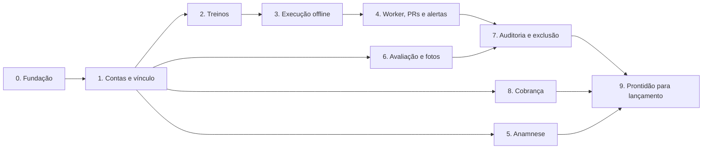

# Plano de Construção

Plano do MVP em fases, na ordem em que cada uma destrava a próxima. Cada item vira uma ou mais tarefas/PRs pequenos; marque `[x]` quando estiver **pronto** pelos critérios da fase, não quando o código "existir".

**Tamanho relativo:** P (dias), M (1 a 2 semanas), G (2 semanas ou mais), para uma pessoa em tempo integral. Serve para comparar fases, não como prazo.

Referências: [ARQUITETURA.md](ARQUITETURA.md) · [BACKEND-PATTERN.md](BACKEND-PATTERN.md) · [FRONTEND-PATTERN.md](FRONTEND-PATTERN.md).

---

## Decisões em aberto

| Decisão | Bloqueia | Responsável | Status |
|---|---|---|---|
| Fotos fora do Brasil (R2) ou S3 sa-east-1 | Fase 6 | Jurídico | Aberta (padrão: S3 sa-east-1) |
| Prazos de retenção (anamnese, fotos, audit, backups) e RIPD | Fases 7 e 9 | Jurídico | Aberta |
| Novo personal vê o histórico do aluno com o anterior? | Fase 1 (policies de leitura) | Produto | **Decidida (02/10/2026): vê** (o histórico acompanha o aluno; informado no consentimento) |
| Provedor de login (Cognito, Auth0, Clerk, Firebase) | Fase 0 | Técnico | **Decidida (01/10/2026): Firebase Auth** |
| Alunos menores de idade no MVP | Fase 1 | Produto + jurídico | **Decidida (02/10/2026): aceitos com consentimento do responsável**; em 03/10/2026, o próprio responsável autoriza por link no celular dele (SCREEN-FLOWS 1.2b). Revisão jurídica antes do lançamento, Fase 9 |
| Preço dos planos e plano gratuito | Fase 8 | Produto | Aberta |
| Cobrança dentro do app: compra da loja (IAP / Google Play Billing) ou pagamento alternativo/link externo | Fase 8 | Produto + técnico | Aberta (ver Fase 8) |
| Nome do produto e pacote base | Fase 0 | Produto | **Decidida (01/10/2026): MoveUp, `br.com.moveup`** |
| RDS Proxy ou PgBouncer próprio | Fase 9 | Técnico (teste de *pinning*) | Padrão: PgBouncer |

---

## Fase 0 — Fundação · G

Tudo o que as outras fases assumem que já existe.

- [x] Monorepo: `backend/` (Maven, Java 21, Spring Boot 4 — migrado do 3.5 em 02/10/2026 por segurança), `apps/mobile` (Expo, app único com os dois perfis), `site/` (estático: convite, termos, privacidade), `packages/{api-client,domain,config}` (pnpm).
- [x] `docker compose` local: PostgreSQL 16, PgBouncer ≥ 1.21, RustFS (S3 local; substituiu o MinIO, que deixou de publicar imagens).
- [x] Migrations V1 a V12 no Flyway + **V13** (`V13__client_keys_tombstones.sql`): tabela `client_key` e `deleted_at` nas tabelas que o app baixa (treinos, programas, restrições).
- [x] Teste `scenarios.sql` portado para Testcontainers (RLS, FK composta, worker, limite do plano).
- [x] Geração do jOOQ a partir das migrations no build.
- [x] Módulos vazios com a estrutura `api/domain/application/infrastructure` e regras **ArchUnit** ligadas.
- [x] `shared`: `IdGenerator` (UUIDv7), `Clock`, `DomainException`, `GlobalProblemHandler` (RFC 9457), `PostgresErrorTranslator`, `RlsTransactionManager` (`set_config` por transação), logger sem PII.
- [x] Spring Security como resource server (JWKS do provedor) + resolução `sub` → `auth_identity` → `app_user`.
- [x] springdoc + `openapi.yaml` commitado + diff no CI; Orval gerando `packages/api-client`.
- [x] Frontend: tsconfig strict, ESLint (com boundaries) e Prettier, providers base, `shared/lib/http` com `AppError`, `env.ts` com Zod.
- [ ] CI (GitHub Actions): build, testes, ArchUnit, Spotless, typecheck, lint, cobertura, dependency-check. *O `ci.yml` já passa no GitHub (02/10/2026). Falta a primeira execução do `dependency-check.yml` (secret `NVD_API_KEY`); marcar quando ela passar.*

**Pronto quando:** um endpoint de exemplo autenticado responde, erro sai em `ProblemDetail`, uma tabela com RLS tem teste passando, e o cliente gerado é usado num hook de teste no app.

---

## Fase 1 — Contas, vínculo e convite · M

- [x] Cadastro/login pelo provedor; criação de `app_user`, `organization` (automática para profissional) e `professional_profile`.
- [x] Registro de `consent` (termos, privacidade, dados de saúde, fotos) com versão do texto.
- [x] Pré-cadastro de aluno (`client`) e `coaching_link` pendente.
- [x] Convite por link/código/QR; aceite via `accept_invite` (limite do plano, reaproveitamento de cadastro).
- [x] Plano de teste/gratuito semeado e assinatura `trialing` criada para toda organização nova.
- [x] Inativar, reativar (com checagem de limite) e encerrar vínculo.
- [x] Escolha de perfil no cadastro (profissional ou aluno via convite) e navegação separada por perfil no mesmo app.
- [x] Telas: login, onboarding do profissional, lista de alunos e convite (perfil profissional); aceite de convite (perfil aluno). *Refeitas no sistema visual Impacto em 03/10/2026 (abas em pílula, estados de vazio/carregando/sem internet/erro).*
- [x] Autorização do responsável pelo aluno menor por link (V16, página `/autorizar/` no site, tela de espera no app).
- [ ] Universal links / app links do convite (`site/` com `apple-app-site-association` e `assetlinks.json`). *Código pronto (02/10/2026): página `/i/<código>`, geração dos dois arquivos no build e `associatedDomains`/`intentFilters` no app. Sem domínio pago por decisão (02/10/2026): site em `moveup-site.pages.dev` (Cloudflare Pages grátis). Falta o SHA-256 do certificado Android (primeiro build EAS); iPhone sem universal link até existir conta Apple Developer (lá o convite entra pelo código). Marcar quando o link abrir o app num build Android.*

**Pronto quando:** dois profissionais e três alunos em teste E2E mostram isolamento completo (RLS + autorização no caso de uso), e o limite do plano barra o aceite excedente.

---

## Fase 2 — Treinos (o planejado) · G

- [x] Biblioteca base de exercícios (seed) + exercícios próprios do profissional, com busca por nome sem acento. *V17: 74 exercícios em português, músculos com os códigos do mapa muscular; busca por parte do nome ou nome parecido.*
- [x] Agregado `Workout` com versões, blocos (todos os métodos, Tabata como preset) e séries (tipos de série, faixa de reps, unilateral).
- [x] Templates e atribuição (cópia com `source_template_id`).
- [x] Programa com agenda: dias fixos ou sequência com meta semanal. *Um programa ativo por vínculo: criar outro arquiva o anterior.*
- [x] Concorrência otimista (`ETag`/`If-Match`) na edição. *V18/V19: revisão no treino e no programa; 412 `version-mismatch`, 428 `if-match-required`.*
- [ ] Editor de treino no app (celular e tablet): bloco a bloco, folhas inferiores para exercício e séries, reordenar com toque longo, rascunho local se cair a internet. *Feito (03/10/2026): bloco a bloco, folhas inferiores (método e séries), reordenar segurando e arrastando (com ações de leitor de tela para subir/descer), conflito 412 e rascunho no SQLite que sobrevive a fechar o app. Falta só o layout de tablet em duas colunas.*
- [x] App: "treino de hoje" e lista do programa, lidos do SQLite após sync. *`GET /v1/sync` por programa (janela de 2 min, tombstones) e expo-sqlite no app.*

**Pronto quando:** editar um treino que já tem sessão cria nova versão e a sessão antiga continua comparando com o planejado original. *Coberto por `ProgramsEndpointTest` (03/10/2026).*

---

## Fase 3 — Execução offline-first · G

- [x] SQLite com sessões, exercícios e séries realizados + fila local. *(expo-sqlite direto, sem Drizzle: migrations ordenadas em `shared/lib/local-db.ts`.)*
- [x] Feature `sync`: envio idempotente (`POST /v1/sync`), recebimento com janela de 2 min e tombstones.
- [x] Tela de execução: séries pré-preenchidas, pular/substituir exercício, timer por método (funciona com tela bloqueada). *(Aviso do fim do descanso por notificação local (`expo-notifications`); resultado dos blocos por tempo em `block_result`, identificado pela posição do bloco (V20).)*
- [x] Modo presencial: profissional executa pelo aluno (`performed_by = professional`).
- [x] Finalização: resumo, comparação com a última sessão equivalente, feedback (esforço 0–10) e relato de dor.
- [x] Edição de sessão finalizada (`edited_after_finish_at`).

**Pronto quando:** em teste com rede desligada, um treino inteiro é registrado, o app é fechado, a rede volta e tudo chega ao servidor **uma vez só**, inclusive após reenvio forçado.

> Critério atendido nos testes: `SessionSyncEndpointTest` (reenvio contado uma vez, outbox uma vez) e `execution.test.tsx` (sem rede fica pendente no aparelho; a rede volta e vai uma vez; reenviar não duplica).

---

## Fase 4 — Worker, recordes e alertas · M

- [ ] Poller do outbox (`FOR UPDATE SKIP LOCKED`, backoff, `last_error`) e db-scheduler para jobs recorrentes.
- [ ] Recordes pessoais com histórico (`is_current`), recalculados quando a sessão é editada.
- [ ] Alertas por evento (dor, feedback, esforço alto, sessão editada) e por job diário (inatividade, adesão, avaliação atrasada, liberação pendente), com deduplicação.
- [ ] Central de atenção no app do profissional (resolver, adiar) e configurações de alerta.
- [ ] Push com texto neutro (Expo Push) e registro de `push_device`.
- [ ] Adesão calculada a partir da agenda.

**Pronto quando:** derrubar o worker no meio do processamento e religar não perde nem duplica PR, alerta ou push.

---

## Fase 5 — Anamnese e restrições · M

- [ ] Modelo de perguntas v1 (sistema) com PAR-Q.
- [ ] Preenchimento pelo aluno ao aceitar o convite; revisão e complemento pelo profissional.
- [ ] Versionamento e imutabilidade após revisão.
- [ ] Restrições (`health_restriction`) com aviso no perfil e na tela de montar treino.
- [ ] Liberação médica pendente gera alerta.
- [ ] Criptografia de campo com `FieldCipher` (Tink + DEK por aluno em `client_key`).

**Pronto quando:** um dump do banco não mostra respostas da anamnese em texto e a restrição aparece ao montar treino para o aluno certo.

---

## Fase 6 — Avaliação e fotos · M

- [ ] Avaliações (peso, altura, % de gordura com método, medidas padrão e personalizadas), registradas pelo aluno ou pelo profissional.
- [ ] Gráficos de evolução (peso, medidas, carga por exercício, pace).
- [ ] Upload de fotos: link pré-assinado com limite de tamanho → `incoming/` → confirmação → worker (magic bytes, remoção de EXIF/GPS, thumbnail) → `processed/`.
- [ ] Leitura só de fotos `ready`, com link temporário; consentimento `photos` obrigatório.
- [ ] Comparação inicial × atual.

**Pronto quando:** uma foto com GPS enviada pelo app nunca é acessível com metadados, e um usuário sem vínculo recebe 404 ao pedir o link.

---

## Fase 7 — Auditoria e exclusão de conta · M

- [ ] `audit_log` gravado na mesma transação: visualização de foto e anamnese, eventos de vínculo, exclusão de conta.
- [ ] Partições mensais criadas com antecedência; job de arquivamento (exporta, confere hash, envia ao bucket com Object Lock, só então remove a partição).
- [ ] Exclusão de conta pelo app: anonimização, remoção de fotos, **crypto-shredding** (apagar `client_key`).
- [ ] Exportação dos dados do titular (LGPD).

**Pronto quando:** após excluir uma conta de teste, nenhum dado de saúde dela é legível no banco, no storage ou num backup restaurado.

---

## Fase 8 — Cobrança · M

- [ ] Decidir o meio de cobrança no app. Sem painel web, a assinatura é comprada dentro do app: no iOS no Brasil, desde o acordo da Apple com o CADE (jun/2026), dá para usar a compra da Apple ou pagamento alternativo/link externo (com comissões diferentes); no Android, conferir as regras do Google Play Billing para assinaturas no Brasil.
- [ ] Planos e assinatura no meio escolhido, com período de teste.
- [ ] Webhooks com validação de assinatura, idempotência por `provider_event_id` e exceção no WAF.
- [ ] Downgrade com escolha de quais alunos inativar.
- [ ] Bloqueio de novos convites ao atingir o limite (nunca bloquear execução de aluno ativo).

**Pronto quando:** o mesmo webhook entregue duas vezes não muda nada na segunda, e o limite do plano é respeitado sob aceites simultâneos.

---

## Fase 9 — Prontidão para lançamento · M

- [ ] Observabilidade: métricas, traces, logs estruturados sem PII, Sentry com scrub, painéis e alertas (p95, erros, fila do outbox).
- [ ] Teste de carga no perfil de pico (6h–8h e 18h–21h) com folga de 3×.
- [ ] Pentest (foco em IDOR/BOLA, upload, webhooks) e correção dos achados.
- [ ] Restauração de backup testada (PITR) e cronometrada.
- [ ] Infra em Terraform: produção em sa-east-1, VPC endpoints, ALB aceitando só Cloudflare.
- [ ] Jurídico: termos, política de privacidade, RIPD, consentimentos revisados.
- [ ] Lojas: exclusão de conta no app, Sign in with Apple, formulários de privacidade (App Store e Google Play).
- [ ] Versão mínima do app controlada pela API.

**Pronto quando:** o checklist acima está completo e um grupo pequeno de personais usou o sistema por pelo menos duas semanas sem incidente de dados.

---

## Depois do MVP (V2)

Smartwatch (HealthKit/Health Connect), periodização por semanas, 1RM estimado e carga sRPE, anamnese com perguntas do profissional, exportar ficha em PDF, Studio com vários profissionais, Redis e Multi-AZ conforme os gatilhos da ARQUITETURA.md (seção 11).
