# Fluxos de Telas

Fluxos do MVP no **app único** (`apps/mobile`), que tem dois perfis: **aluno** e **profissional**. Não existe painel web. Rotas e nomes de feature em inglês, textos de tela em português. Os diagramas usam Mermaid e aparecem como imagem no GitHub.

Referências: [FRONTEND-PATTERN.md](FRONTEND-PATTERN.md) (estrutura e regras) · [ARQUITETURA.md](ARQUITETURA.md) (sync, fotos, segurança) · [PLANO.md](PLANO.md) (em que fase cada fluxo entra).

**Legenda dos diagramas:** retângulo = tela · losango = decisão · retângulo arredondado = ação do sistema · `[[ ]]` = ação que exige internet.

---

## Parte 0 — Entrada no app e perfis

### 0.1 Mapa de rotas (Expo Router)

```
app/
├── _layout.tsx                     Decide o grupo de rotas pelo papel do usuário logado
├── (auth)/
│   ├── welcome.tsx                 "Sou personal" / "Tenho um convite"
│   ├── sign-in.tsx                 Entrar (Google, Apple, e-mail)
│   └── i/[code].tsx                Link do convite (moveup-site.pages.dev/i/CODIGO): guarda o código e segue a entrada
├── (client)/                       PERFIL ALUNO
│   ├── onboarding/{consent,accept-invite,anamnesis}.tsx
│   ├── (tabs)/{home,training,history,progress,profile}.tsx
│   ├── history/[sessionId].tsx
│   └── progress/{assessment/new,photos/new}.tsx
├── (professional)/                 PERFIL PROFISSIONAL
│   ├── onboarding/{profile,plan}.tsx
│   ├── (tabs)/{dashboard,clients,training,alerts,settings}.tsx
│   ├── clients/new.tsx
│   ├── invite-share.tsx            Código, QR Code, WhatsApp e compartilhar do convite
│   ├── clients/[id]/{overview,program,sessions,assessments,anamnesis,notes}.tsx
│   ├── training/workouts/[id]/edit.tsx
│   ├── training/templates.tsx
│   └── exercise-library.tsx
└── session/[id]/                   COMPARTILHADO: execução (aluno e presencial do profissional)
    ├── index.tsx
    ├── feedback.tsx
    └── summary.tsx
```

- Uma conta tem **um** papel no MVP. O `_layout.tsx` raiz redireciona para `(client)` ou `(professional)`; um grupo não acessa as rotas do outro.
- Telas do profissional têm layout de **tablet** (duas colunas) no editor de treino e no perfil do aluno.

### 0.2 Primeira abertura

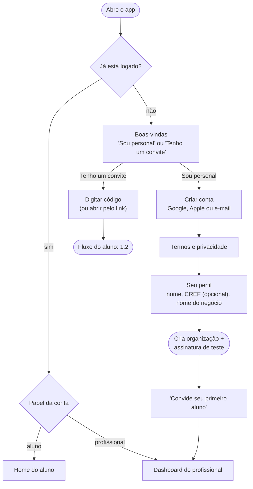

---

## Parte 1 — Perfil do aluno

### 1.1 Telas do aluno

| Tela | Feature | Funciona offline? | Endpoints |
|---|---|---|---|
| sign-in, invite, accept-invite | `auth`, `invite` | Não | provedor de login, `POST /v1/invites/{code}/accept` |
| consent, anamnesis | `invite`, `anamnesis` | Não (envio) | `POST /v1/consents`, `POST /v1/anamnesis` |
| home, training | `training` | Sim (SQLite) | `GET /v1/sync` |
| session/* | `execution` | **Sim** | `POST /v1/sync` |
| history | `history` | Sim (o que já sincronizou) | `GET /v1/sync` |
| progress | `progress` | Leitura sim; fotos não | `POST /v1/assessments`, `POST /v1/photos` |
| profile | `auth`, `anamnesis` | Parcial | vários |

### 1.2 Primeiro acesso (convite → onboarding)

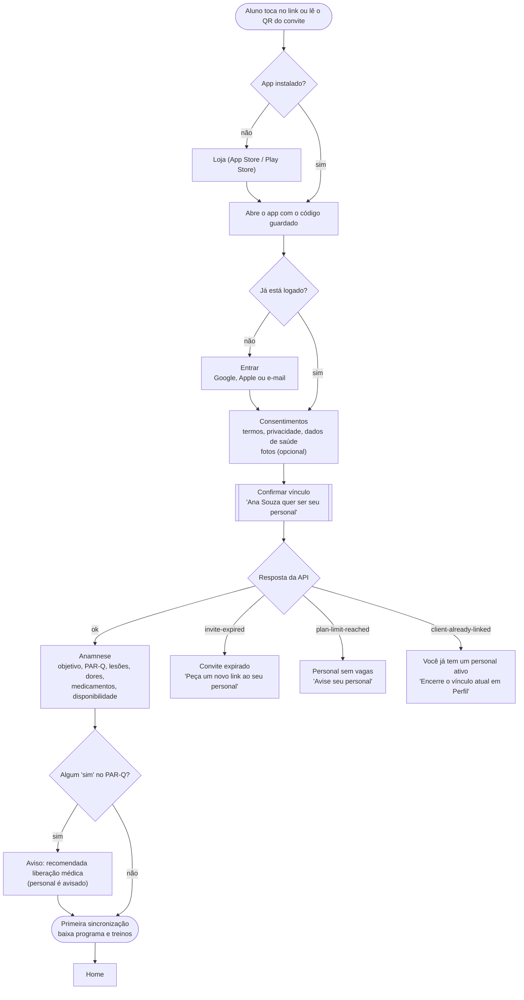

- Sem convite, o app abre na tela "Peça o link ao seu personal", com campo para digitar o código. No MVP o aluno não usa o app sem vínculo.
- A anamnese pode ser salva como rascunho e terminada depois. Enquanto não for enviada, a Home mostra um aviso fixo.

### 1.2b Aluno menor: autorização do responsável (LGPD, art. 14)

Decisão de 03/10/2026: o menor só **indica** o responsável; quem autoriza é o próprio responsável,
pelo link que recebe no celular dele. Sem autorização, o menor não aceita convite.

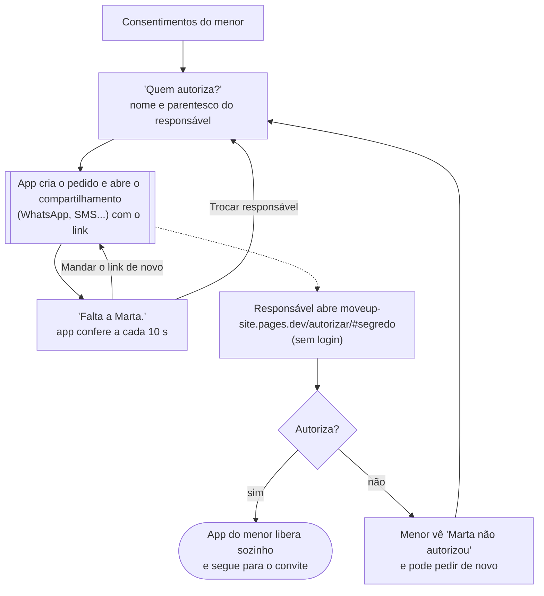

- O link vale 7 dias e uma vez; reenviar troca o link (o anterior para de valer). O banco guarda
  só o hash do segredo, e a página manda o segredo no corpo da requisição (nunca na URL).
- A página mostra só o primeiro nome do menor e o que o app guarda; nenhum dado de saúde.
- Não guardamos telefone nem e-mail do responsável: o link vai pelo celular do menor.

### 1.3 Treino do dia e execução (offline-first)

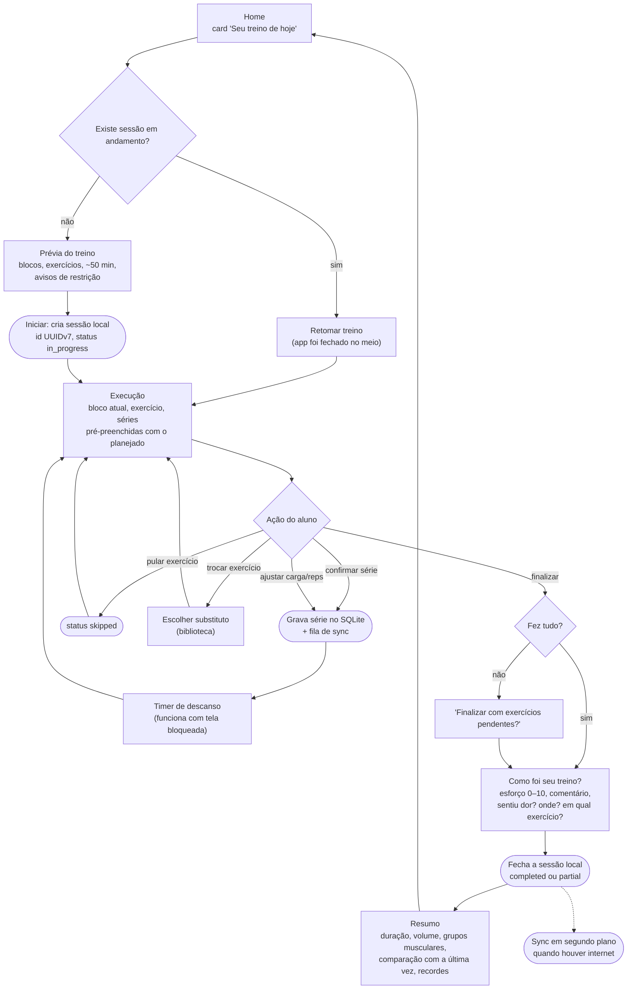

**Telas de execução por método de bloco:**

| Método | O que a tela mostra | Timer |
|---|---|---|
| Sequencial | Um exercício por vez, lista de séries | Descanso entre séries |
| Biset / Triset | Os 2–3 exercícios do round lado a lado | Descanso ao fim do round |
| Circuito | Lista do circuito com o atual destacado, contador de rounds | Transição e descanso entre rounds |
| HIIT / Tabata | Exercício atual em tela cheia | Trabalho/descanso automático com bipes |
| EMOM | Tarefa do minuto | Relógio de minuto em minuto |
| AMRAP | Lista de tarefas + contador de rounds e reps extras | Regressivo do tempo total |
| Intervalado | Estímulo atual (forte/leve), distância ou tempo | Por intervalo |

**Regras da tela de execução:** botões grandes, uma ação principal por vez, sem depender de internet, aviso discreto "sem conexão — tudo será enviado depois" quando offline. Se houver restrição ativa (ex.: joelho), o exercício afetado mostra o aviso do personal.

### 1.4 Estados da sessão e do sync

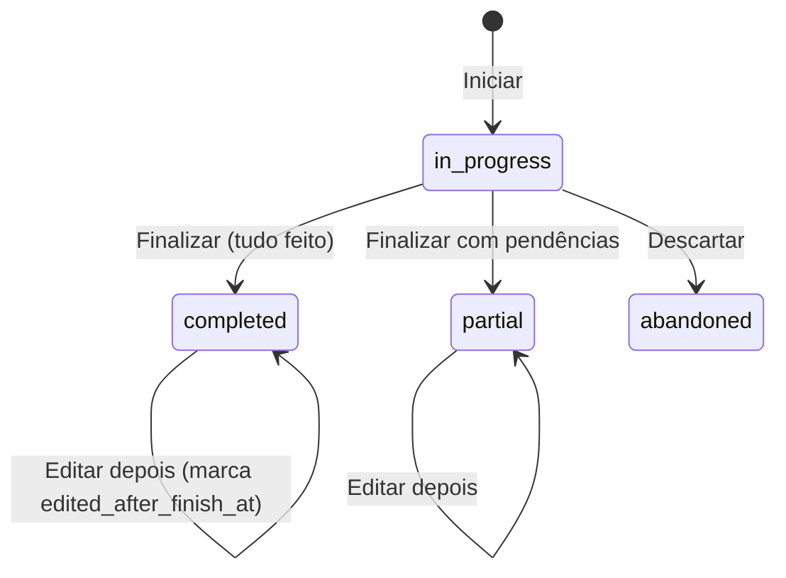

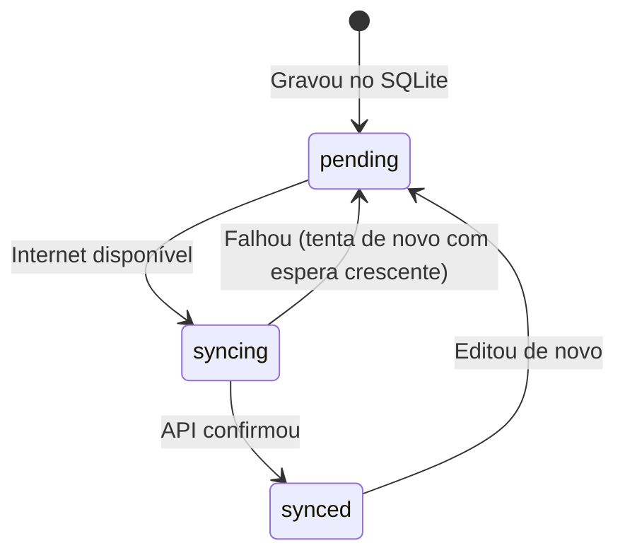

Na tela de Histórico, sessões ainda não enviadas mostram um ícone de nuvem com relógio. Nada é bloqueado por isso.

### 1.5 Avaliação e fotos

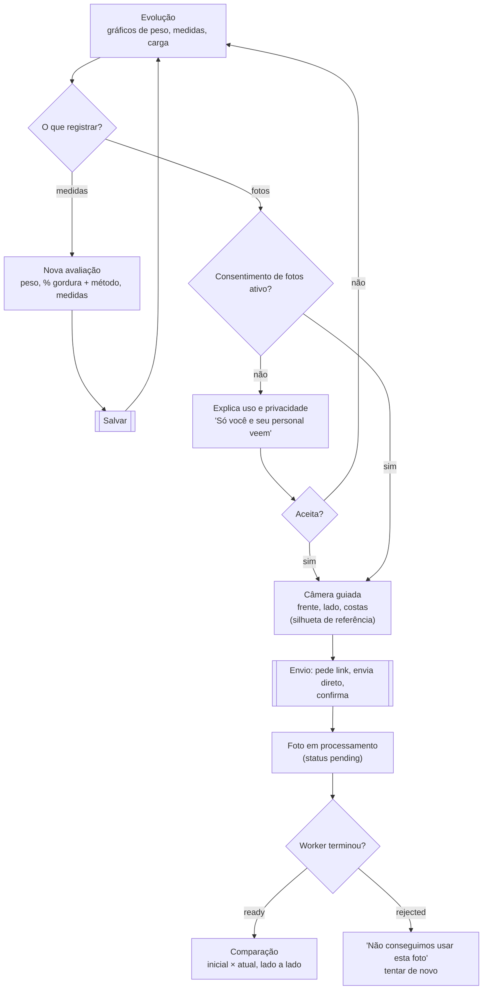

- Envio de fotos exige internet. Sem internet, o botão fica desabilitado com explicação; as fotos **não** ficam guardadas no rolo da câmera do aparelho.
- Telas de fotos bloqueiam captura de tela (se adotado) e não aparecem no session replay.

### 1.6 Perfil, privacidade e saída

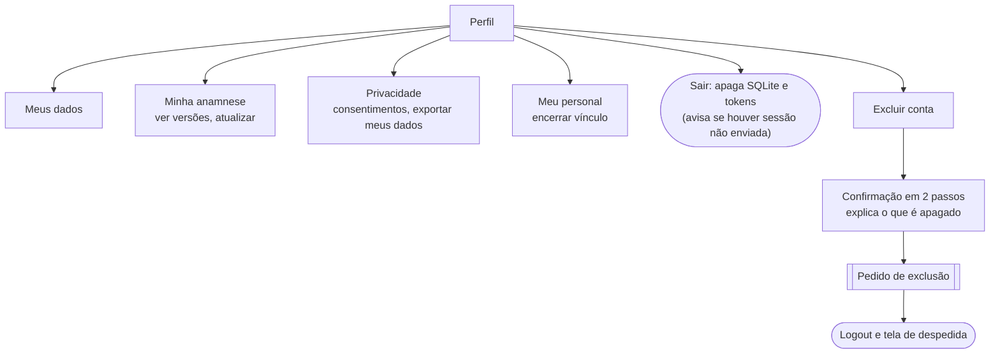

---

## Parte 2 — Perfil do profissional

### 2.1 Telas do profissional

| Aba / tela | Feature | Funciona offline? | Observação |
|---|---|---|---|
| Dashboard | `alerts`, `clients` | Leitura do cache | Indicadores + "N alunos precisam de atenção" |
| Alunos (lista, novo, perfil com abas) | `clients` | Leitura do cache | Abas: resumo, programa, sessões, avaliações, anamnese, notas |
| Treinos (templates, editor) | `training` | Edição sim, **salvar exige internet** | Rascunho local se a conexão cair |
| Biblioteca de exercícios | `exercise-library` | Leitura do cache | Busca sem acento |
| Atenção | `alerts` | Leitura do cache | Resolver/adiar exige internet |
| Treino presencial | `execution` | **Sim** | Usa `session/[id]`, com `performedBy = professional` |
| Ajustes | `billing`, `alerts` | Não | Plano e uso (alunos ativos / limite), limites de alerta, push |

**Navegação:** 5 abas embaixo (Dashboard, Alunos, Treinos, Atenção, Ajustes). No tablet, a lista de alunos e o perfil ficam lado a lado.

### 2.2 Convidar aluno

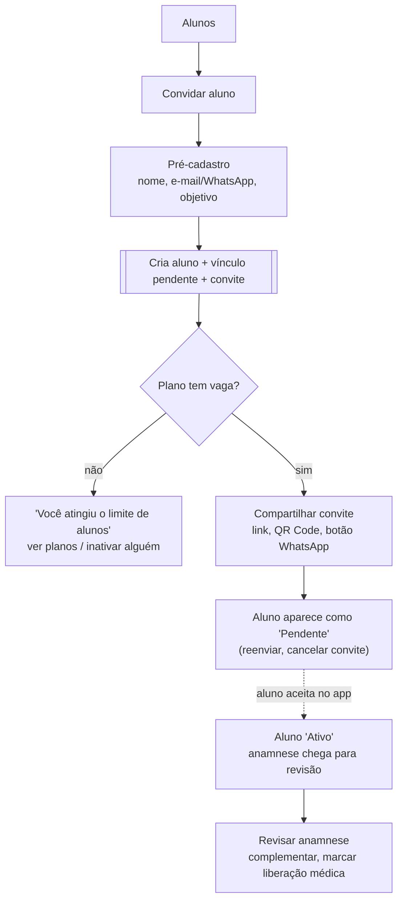

- A checagem de vaga acontece de novo no aceite (no banco, com trava), porque o limite pode ter sido atingido entre o convite e o aceite.

### 2.3 Montar treino e agenda

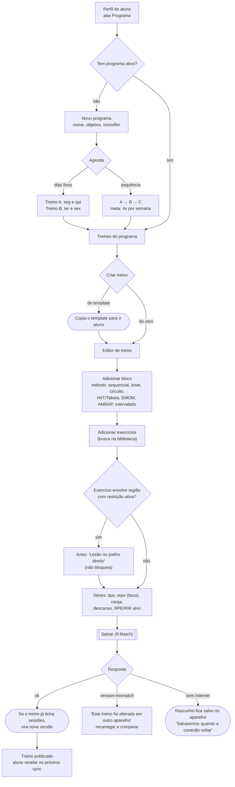

- "Salvar como template" fica disponível no editor a qualquer momento.
- **Editor no celular:** um bloco por cartão; adicionar exercício e editar séries abrem em folha inferior (*bottom sheet*); reordenar com toque longo e arrastar. A gravação é única, no Salvar.
- **No tablet:** lista de blocos à esquerda e edição do bloco à direita.

### 2.4 Central de atenção

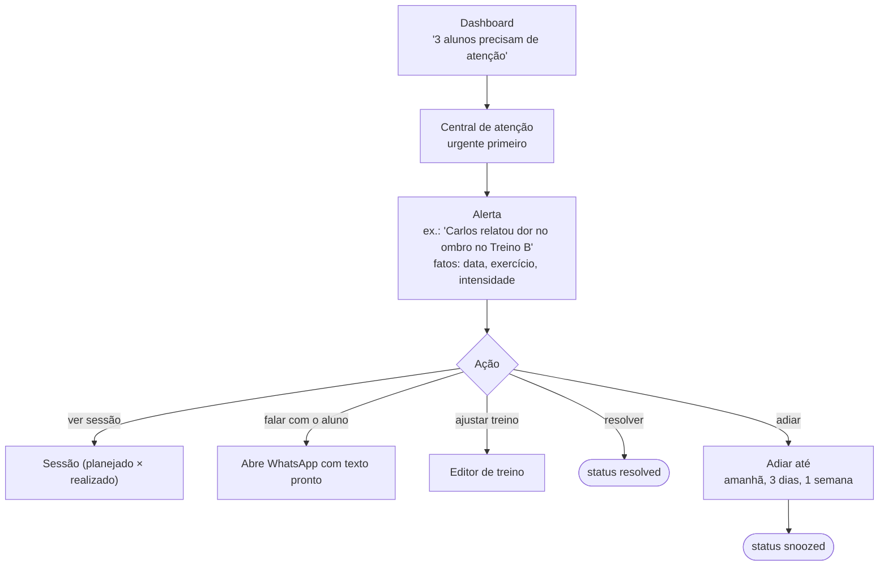

| Alerta | Severidade | Aparece em |
|---|---|---|
| Dor relatada | Urgente (push opcional) | Topo da central, perfil do aluno |
| Liberação médica pendente | Atenção | Central, aba Anamnese |
| Novo feedback | Info | Central, aba Sessões |
| Sem treinar há N dias | Atenção | Central, lista de alunos |
| Adesão baixa | Atenção | Central, overview do aluno |
| Esforço alto repetido | Atenção | Central |
| Avaliação atrasada | Info | Central, aba Avaliações |
| Sem alteração de indicador | Info | Central |
| Sessão editada após finalizar | Info | Central, aba Sessões |

### 2.5 Treino presencial

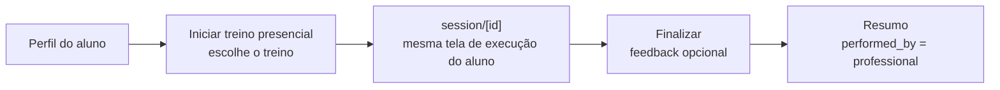

Funciona offline (academia sem sinal), igual ao aluno: grava no SQLite do aparelho do profissional e sincroniza depois. O aluno vê a sessão no histórico dele após o sync.

### 2.6 Plano e assinatura

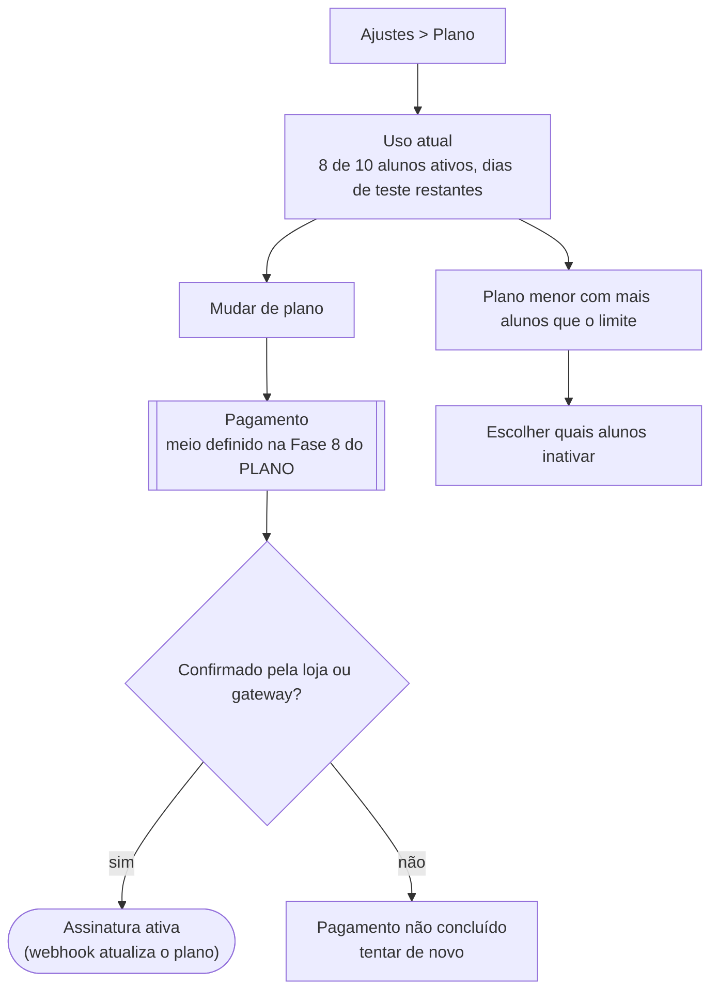

Sem painel web, a assinatura é contratada dentro do app. O meio de pagamento (compra da loja ou pagamento alternativo/link externo) é uma decisão em aberto no `PLANO.md`.

---

## Parte 3 — Estados de tela e erros

Toda tela de dados implementa os quatro estados. O texto de erro vem do catálogo por `code` (FRONTEND-PATTERN.md, seção 9).

| Tela | Vazio | Carregando | Sem internet | Erro |
|---|---|---|---|---|
| Home (aluno) | "Seu personal ainda não montou seu treino" | Skeleton do card | Mostra dados locais + aviso discreto | Dados locais + "tentar sincronizar" |
| Execução | — | — | Funciona normal | Nunca bloqueia; falha de gravação local = erro grave (Sentry) |
| Histórico | "Seus treinos aparecem aqui" | Skeleton da lista | Mostra o que já sincronizou | Idem |
| Evolução | "Registre sua primeira avaliação" | Skeleton dos gráficos | Leitura local; fotos desabilitadas | Por bloco |
| Alunos | "Convide seu primeiro aluno" + botão | Skeleton da tabela | Banner "sem conexão" | Error boundary da rota |
| Editor de treino | "Adicione o primeiro bloco" | — | Rascunho local, salva quando voltar a conexão | `version-mismatch` → tela de conflito |
| Central de atenção | "Tudo em dia por aqui" | Skeleton | Banner | Error boundary |

| `code` da API | Onde aparece | Mensagem |
|---|---|---|
| `invite-expired` | Aceite de convite | Convite expirado. Peça um novo link ao seu personal. |
| `plan-limit-reached` | Aceite (aluno) / convidar (personal) | Aluno: seu personal está sem vagas no momento. Personal: você atingiu o limite de alunos do seu plano. |
| `client-already-linked` | Aceite de convite | Você já tem um personal ativo. Encerre o vínculo atual em Perfil. |
| `version-mismatch` | Editor de treino | Este treino foi alterado em outro aparelho. |
| `resource-not-found` | Qualquer detalhe | Não encontramos o que você procurava. |
| `rate-limited` | Qualquer | Muitas tentativas. Aguarde um instante. |
| `internal-error` | Qualquer | Algo deu errado. Tente de novo. |

---

## Fora do MVP (não desenhar ainda)

Chat, smartwatch, periodização por semanas, Studio com vários profissionais, marketplace de programas, cobrança dos alunos pelo personal.
